# ExamVision — AI-Powered Exam Proctoring System

Live classroom monitoring with real-time student detection, pose estimation, gaze tracking, phone detection, behaviour analysis, and post-exam reporting.

## Architecture

```mermaid
flowchart TB
    subgraph Sources["Video Sources"]
        RTSP["RTSP Camera"]
        USB["USB Camera"]
        FILE["Recorded File"]
    end

    subgraph Ingestion["Ingestion Layer"]
        SM["StreamManager"]
        PRE["FramePreprocessor"]
        FS["Frame Skipper<br/>(every Nth frame)"]
    end

    subgraph Detection["Detection Pipeline"]
        YOLO["YOLOv8 Detector<br/>(ONNX/PyTorch/FP16/INT8)"]
        BT["ByteTrack Tracker"]
        PP["Post-Processor"]
    end

    subgraph Analysis["Analysis Services"]
        PO["YOLOv8 Pose<br/>parallel per-person"]
        FA["MediaPipe Face<br/>+ Head Pose"]
        GA["Gaze Estimator"]
        PH["Phone Detector<br/>+ hand proximity"]
    end

    subgraph Behaviour["Behaviour Engine"]
        BA["BehaviourAnalyser<br/>7 rules, sliding window"]
        SS["SuspicionScorer<br/>weighted + decay"]
    end

    subgraph API["API Layer"]
        FAST["FastAPI<br/>REST + WebSocket"]
        REP["ReportGenerator<br/>PDF/CSV/timeline"]
        PROF["FrameProfiler<br/>benchmark"]
    end

    subgraph Frontend["React Dashboard"]
        LVC["Live Video + Overlays"]
        EF["Event Feed"]
        SG["Student Grid"]
        AP["Alert Panel"]
        PERV["Post-Exam Reports"]
    end

    Sources --> Ingestion --> Detection --> Analysis --> Behaviour --> API --> Frontend
```



## Quick Start

```bash
# Infra (PostgreSQL + Redis)
docker compose up -d postgres redis

# Backend
cd backend
pip install -e ".[dev]"
alembic upgrade head
uvicorn app.main:app --reload --port 8000

# Dashboard
cd dashboard
npm install
npm run dev
```

## Stack

| Component | Technology |
|---|---|
| Backend | Python 3.12+, FastAPI, SQLAlchemy (async) |
| Detection | YOLOv8 (PyTorch / ONNX / FP16 / INT8) |
| Tracking | ByteTrack |
| Face / Gaze | MediaPipe, L2CS-Net |
| Database | PostgreSQL + Redis |
| Dashboard | React 18, TypeScript, Tailwind, Vite |
| Reports | ReportLab (PDF), CSV |
| Infra | Docker Compose, NVIDIA GPU |

## Configuration

All settings via `PROCTOR_*` environment variables. Key ones:

| Variable | Default | Description |
|---|---|---|
| `PROCTOR_VIDEO_PROCESS_EVERY_N` | `1` | Frame skipping factor |
| `PROCTOR_DETECTION_INFERENCE_BACKEND` | `pytorch` | `pytorch` or `onnx` |
| `PROCTOR_DETECTION_QUANTIZATION` | `none` | `none`, `fp16`, `int8` |
| `PROCTOR_PROFILING_ENABLED` | `false` | Enable benchmark profiling |

## Production

```bash
docker compose -f docker-compose.yml -f docker-compose.prod.yml up -d
```

Requires NVIDIA GPU + Container Toolkit for ONNX/INT8 inference.

## Tests

```bash
cd backend
python -m pytest -x -q    # 242 tests
ruff check .
mypy app/
```

## License

MIT
